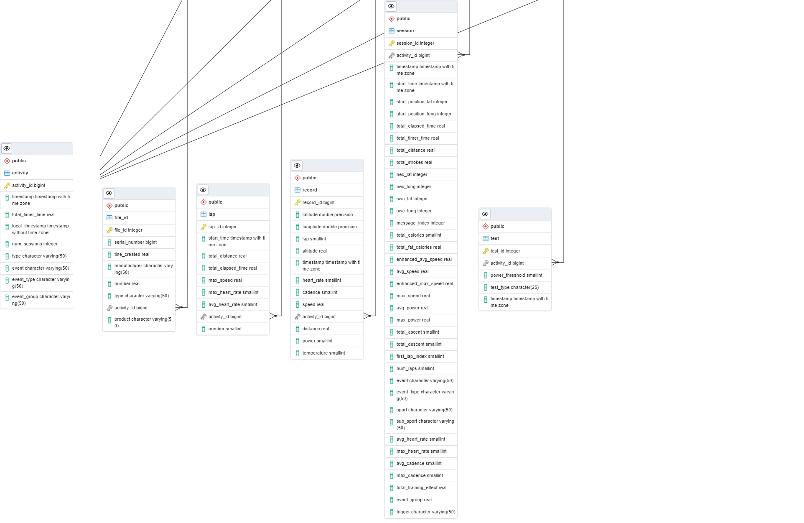

# Fitness File Parser

Parse `.fit`, `.tcx`, and `.gpx` activity files into a PostgreSQL database. Designed for personal fitness data warehousing — extract lap, record, session, and event data from your watch exports and store them in a relational schema for analysis. I have only tested Garmin .fit files. See the FIT SDK from Garmin to see how the file is structured and how to add additional frames/fields for other manufacturers, if the parser does not work. 

This is from a project I did in school, I only maintain .fit file support now. '.tcx' and '.gpx' files will probably not work now. 

I connect the database to a [streamlit application](https://github.com/hevarmette/Activity-Calendar)



## Features

- Parse `.fit` files from Garmin watches (direct USB export) or Garmin Connect (bulk export with JSON metadata)
- Automatic activity naming via reverse geocoding (OSM Nominatim)
- Fallback to SQL file output when database is unavailable
- Incremental loading — only processes files newer than the latest activity in the database
- Swimming lap counting with active/recovery distinction
- Lap power backfilling for existing activities

## Database Schema

The schema consists of 7 tables with `activity` as the central table:

| Table      | Description                                                              |
| ---------- | ------------------------------------------------------------------------ |
| `activity` | One row per activity — timestamps, name, distance, duration, feel/effort |
| `session`  | Session-level aggregates — sport type, bounds, totals, pool info         |
| `lap`      | Per-lap splits — distance, time, heart rate, running dynamics, power     |
| `record`   | GPS trackpoints — lat/lon, altitude, speed, HR, cadence                  |
| `file_id`  | Device metadata — manufacturer, serial number                            |
| `length`   | Swimming lengths — stroke type, speed, stroke count                      |
| `event`    | Activity events — start, stop, lap triggers                              |

Run `schema_garmin_data.sql` to create the tables. The database must already exist.

## Prerequisites

- Python 3.10+
- PostgreSQL database
- `.fit` files from a Garmin device (watch export or Garmin Connect bulk export)

## Setup

```bash
git clone https://github.com/your-username/Fitness-File-Parser.git
cd Fitness-File-Parser
python3 -m venv venv
source venv/bin/activate
pip install -r requirements.txt
```

Create a `.env` file in the project root:

```env
SCHEMA=your_schema
FIT_DIR=/path/to/your/fit/files/
```

> **Note:** `FIT_DIR` must end with a trailing slash.

Initialize the database:

```bash
psql -d your_database -f schema_garmin_data.sql
```

## Usage

### Garmin Connect files (`.fit` + `_summary.json`)

For bulk exports from Garmin Connect where each activity has a `.fit` file and a corresponding `_summary.json` file:

```bash
python3 parse_fit_garmin_connect.py
```

**Assumptions:**

- Files are named `{timestamp}_{activity_id}.fit` (e.g. `2024-01-15T08.30.00_{id}.fit`)
- A matching `{timestamp}_{activity_id}_summary.json` exists alongside each `.fit` file
- Set `ONLY_WRITE_FILE = True` in the script to generate SQL files without a database connection

### Original files (`.fit` only)

For files exported directly from a watch via USB, or files with no summary .json file:

```bash
python3 parse_fit_watch.py
```

**Assumptions:**

- Files are named `YYYY-MM-DD-HH-MM-SS.fit`
- Reverse geocoding calls OSM Nominatim with a 1-second delay per request (fair use policy)

## Project Structure

| File                          | Purpose                                                               |
| ----------------------------- | --------------------------------------------------------------------- |
| `helpers.py`                  | Shared utilities — FIT parsing, DataFrame construction, DB connection |
| `watch_files_to_sql.py`       | SQL INSERT statement generator for all table types                    |
| `parse_fit_watch.py`          | Pipeline for watch-exported `.fit` files                              |
| `parse_fit_garmin_connect.py` | Pipeline for Garmin Connect exported files                            |
| `get_pool_info.py`            | Extract and update pool/swimming session data                         |
| `parse_tcx.py`                | TCX file parser                                                       |
| `parse_gpx.py`                | GPX file parser                                                       |
| `schema_garmin_data.sql`      | PostgreSQL table definitions                                          |

## License

MIT
